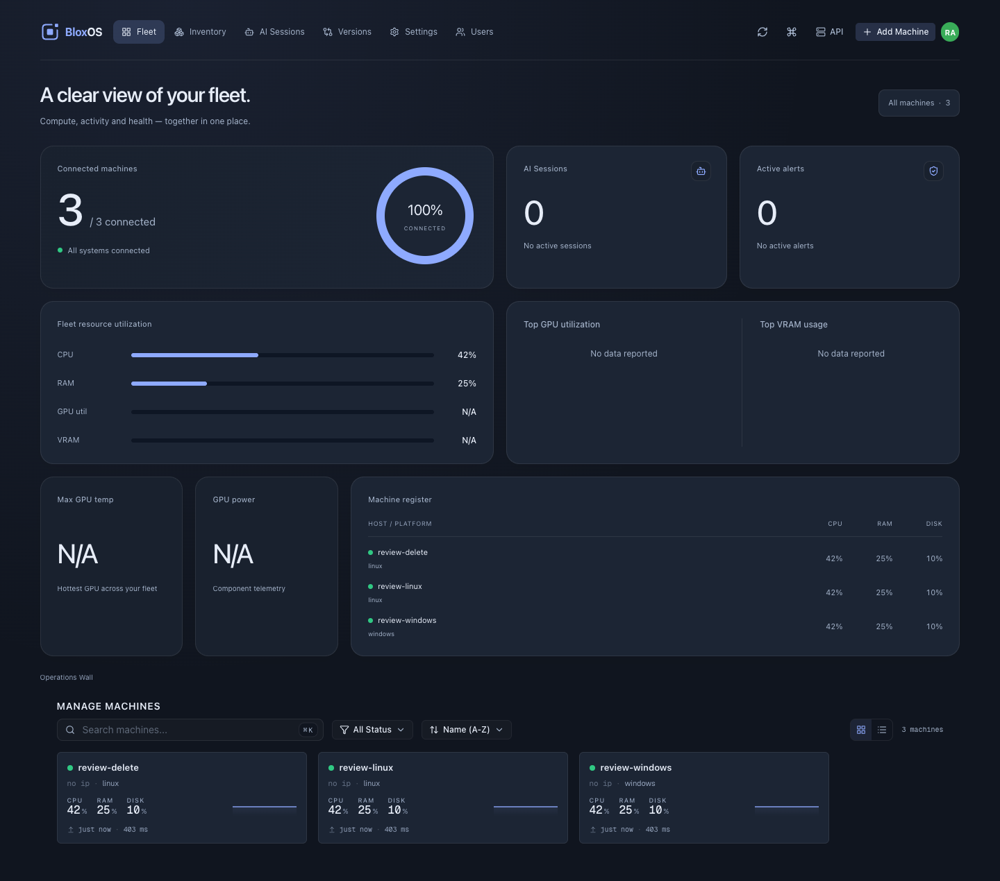
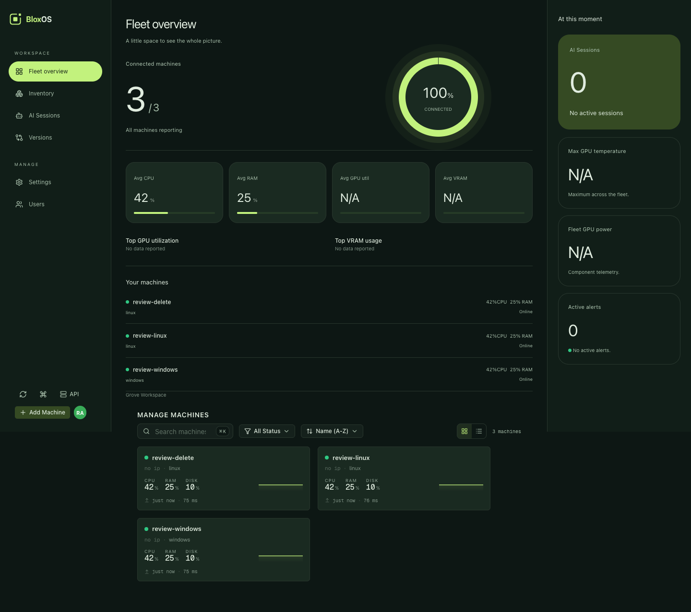
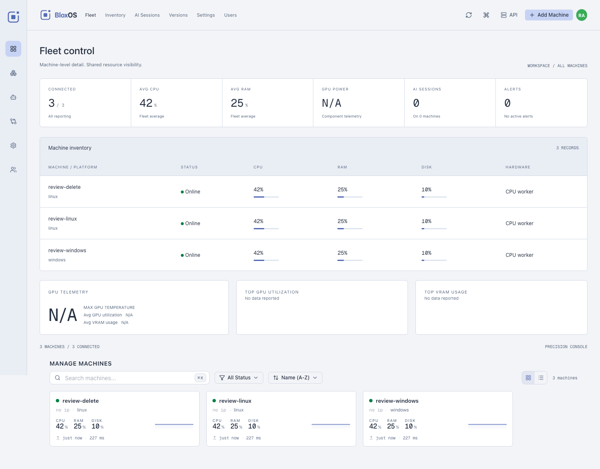

# Dashboard gallery

Three layouts, one live BloxOS application. Each has **Original**, **Bright**
and **Dark** color choices. Choose **Account menu → Design** to switch;
Classic and its eight palettes remain available.

These are screenshots of the actual **v1.1.0** application using three
synthetic test machines. They are not concept renders or production fleet
captures. The demo has no GPU sensors or active AI sessions, so the UI
truthfully shows N/A and zero sessions. Names, readings and connection timing
are illustrative, not hardware benchmarks.

## Operations Wall · Original

An open overview with fleet health, resource bars and a machine register.

## Grove Workspace · Original

A sidebar, central fleet analytics and a separate operational context column.

## Precision Console · Bright

A compact navigation rail and table-first view with telemetry instruments.

## Asset notes

- Captured from the release candidate whose source tree matches v1.1.0
  (`a46b39954616c8c1cb851412ee46fe05c816ab3e`).
- Images are unmodified browser captures, 1440 pixels wide, stored locally so
  the gallery does not depend on an external image host.
- Only synthetic fixture machines are visible. No enrollment links, passwords,
  tokens, real network addresses or private machine names are included.
- The app's canonical [logo SVGs](../../dashboard/public/brand/) are reused by
  the root README; no separate lookalike logo is maintained here.
- When refreshing screenshots, use a disposable demo fleet, wait for the layout
  and fonts to settle, close menus, check all visible content for private data,
  and update this version note. Do not invent telemetry to hide unavailable
  sensors or substitute the static design study for the live application.

[Design and color guide](../themes/README.md) · [Back to BloxOS](../../README.md)
